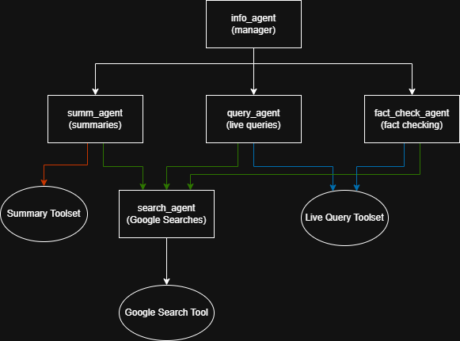
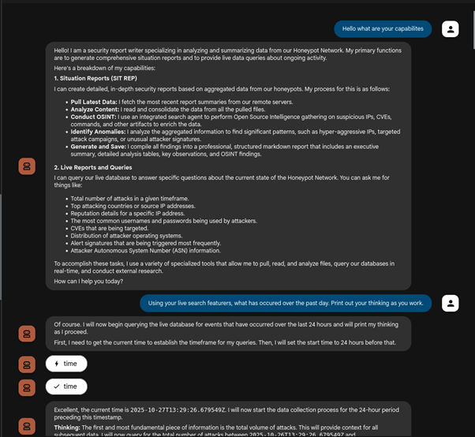
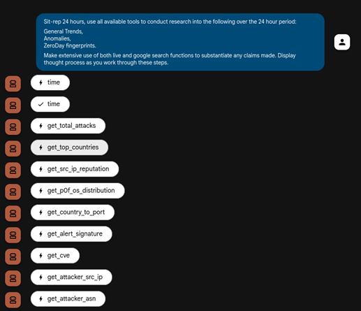
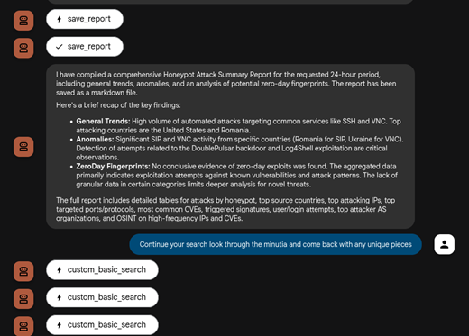
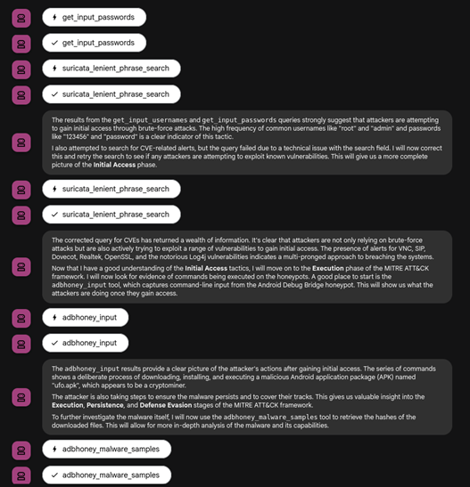
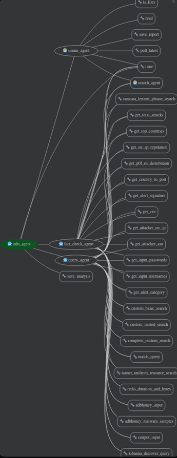

AI Agential System

An AI agential system was built and deployed both on the Hive machine and also running locally on my kali VM. The framework I used to build and develop the system was Google ADK. This open-source framework allows the deployment of easy multi-level agent orchestration applications and allows for creation and use of bespoke tools as well as the incorporation of pre-built tools by Google’s ADK team.

## Deployment

### Hive

Due to the volume of traffic received on the hive in order to generate reports with sufficient granularity an hourly report was ran on the Hive cloud instance. On the hour a cronjob was executed calling the local agent to generate an hourly report. This hourly report was then saved to the “/summaries” file locally on the Hive cloud VM.

### Local VM

In order to establish communications between the Hive Cloud VM’s ELK stack and the local VM an SSH tunnel was used binding port 64298 on the cloud VM to localhost:64298 on the local VM. By setting up this port tunnel it allows for querying the ELK stack from our local VM as well as easy pulling of remote reports in the “/summaries” folder.

## AI Agent Framework

### Hive

The agent deployment on the Hive cloud VM was relatively simple in comparison to what was running locally. On the hive a simple agent was scripted that used queries to generate a report on the hour. Its toolset was limited to reading the Elasticsearch data and generating an hourly summary report. It did not have and was not instructed to conduct any research into the data received; this was to keep the compute resources and API costs low as it was being ran 24 times a day.

### Local VM

This part of the application is intended to be interacted with, and as such the agential framework and feature set is a lot more developed. In this system the “info_agent” acts as a manager agent and is the default entry point for queries. This agent orchestrates the sub agents below it, delivering tasks and transferring jobs to sub agents.

The “summ_agent” makes use of the developed summary toolset as well as the google search agent to generate reports based on the files generated remotely on the cloud VM on request.

The “query_agent” makes use of the live query toolset as well as the google search agent allowing for live user interaction and querying with the ELK stack.

Lastly the “fact_cehck_agent” is used to fact check reports generated by the query agent, this is operation is explained later.

**Figure 1** Basic Host VM Agent Framework  

---

## Modes of Operation

On the local VM the AI application has two modes of operation – summarisation and querying, these two modes are selected through simple prompting asking the AI to either use “live-querying/tools” or simply for “sit-reps”. If no direction is given the AI will use the most relevant toolset to conduct queries.

Google ADK provides a developer web interface called “adk web”, this interface allows for interaction with agents in similar fashion as can be done with other LLMs like ChatGPT. This web interface gives detailed outputs allowing to investigate full agential flow and queries. Every session was also saved to a local SQL database allowing for review of previous queries and findings that weren’t implicitly requested to be saved.

Pairing the web interface with the application allows for users to interact with both the reports, asking for more information and to carry out investigations, and the actual live data being collected remotely on the Hive cloud VM.

**Figure 2** Querying the Agent's Capabilities on Local VM  

---

## Toolset

The abilities of the AI agents are directly tied to the tools they have available, for this reason both pre-built and custom tools were used to fill out the feature set of the agents. For the live querying tools there are two general types. Ones that have their query taken from the Kibana dashboards and ones the AI could create.

For the Kibana dashboard queries, the queries were taken and the key variables like timestamps, order, count, shard_size were set as variables allowing the AI to define the parameters of individual queries. This had two benefits, the first being that structured queries are simpler for the AI to understand cutting down on error rates, and secondly a more “on-rails” query allowed for the return of more easily verifiable empirical data.

The other live-query tools allowed for the AI agents to execute their own semi-custom and custom queries. These were “custom_basic_search”, “custom_nested_search”, “kibanna_discover_query”, “suricata_lenient_phrase_search” and “complete_custom_search”. These queries had a higher error rate due to their open nature but also allowed the agents to carry out more specific searches and stray away from the set Kibana queries.

**Figure 3** Instance of Lenient Custom Live Query  

**Figure 4** Agent/Toolset Tree  

---

## The Hallucination Problem

LLM’s and Gen-AI tend to hallucinate data when prompted, to counteract this a second mirror agent was deployed with the same toolset but with specific instructions to act as a fact checker/validator against data received. To achieve this when a user prompts the application for a live query, the root agent passes the query to the “query_agent”, this agent/user then works through prompt(s) and returns the data/report generated to the root agent. This data/report is then fed into the “fact_check_agent” who performs all necessary searches both against the database and with google to confirm or deny claims made by its sister agent.

**Figure 5** Validation Diagram  

**Figure 6** Sample ADK Web Interaction  

